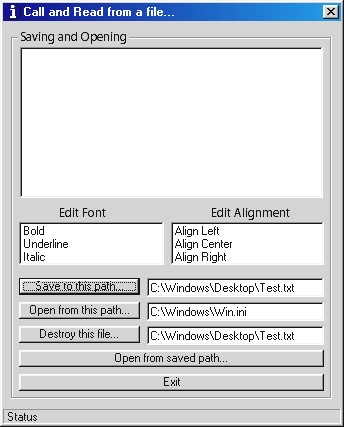



## Easiest way to: Save Texts, Open Texts, Destroy Texts\!

### Description

In my opinion this is the easiest way to Save, Open, and Destroy text [.txt] files.. or pretty much any word document file. I use RichTextBox in this example.. Sorry about the font and alignment controls, i was just messing around, you cant really save them. I dont need votes or comments unless you wanna give them.. enjoy!
 
### More Info
 

             |
---                |---
**Submitted On**   |1997-01-01 03:23:02
**By**             |[RyanConard](https://github.com/Planet-Source-Code/PSCIndex/blob/master/ByAuthor/ryanconard.md)
**Level**          |Beginner
**User Rating**    |5.0 (10 globes from 2 users)
**Compatibility**  |VB 5\.0, VB 6\.0
**Category**       |[Coding Standards](https://github.com/Planet-Source-Code/PSCIndex/blob/master/ByCategory/coding-standards__1-43.md)
**World**          |[Visual Basic](https://github.com/Planet-Source-Code/PSCIndex/blob/master/ByWorld/visual-basic.md)
**Archive File**   |[Easiest\_wa938096132002\.zip](https://github.com/Planet-Source-Code/ryanconard-easiest-way-to-save-texts-open-texts-destroy-texts__1-35780/archive/master.zip)

